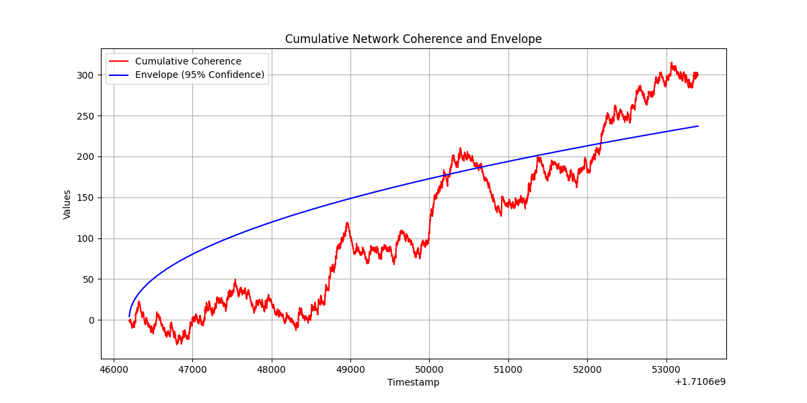

# gcp2-playbox
Miscellaneous repo for my gcp2.net (Global Consciousness Project v2.0) analysis and experimenting. I host one of the EGGs (RNGs).

## Experiment 1

Graphing the cumulative sum of the network coherence sample data.

### Run

```
pip3 install -r requirements.txt
python3 gcp2-testdata-cumsum.py
```

#### Result



### References
https://forum.fp2.dev/t/gcp-2-0-coherence-algorithm/242/5
