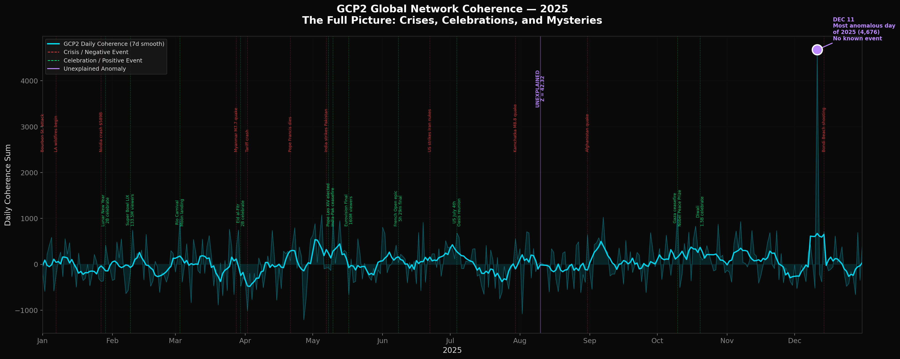
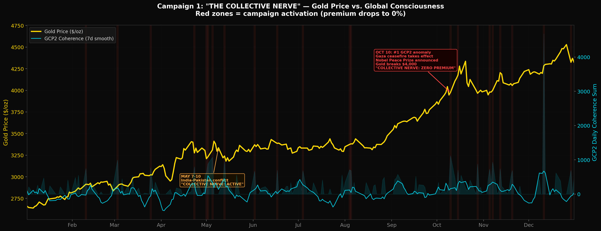
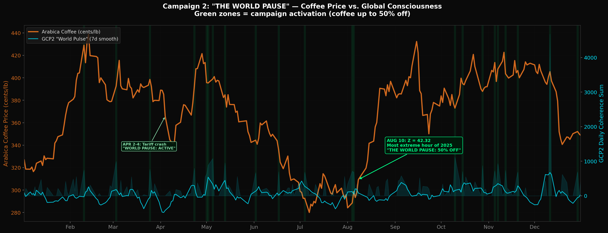
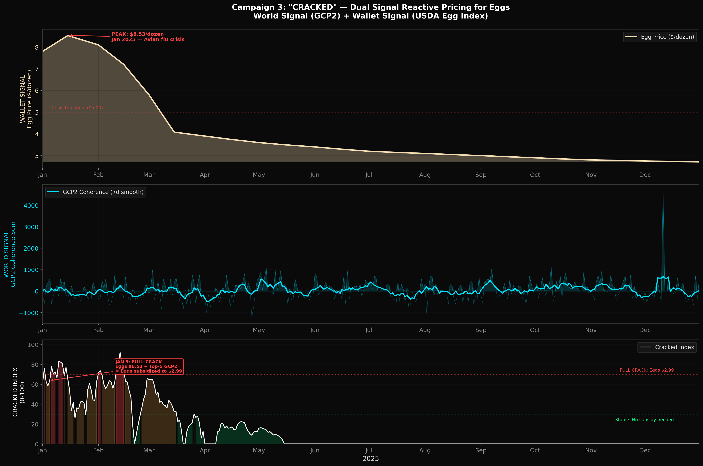
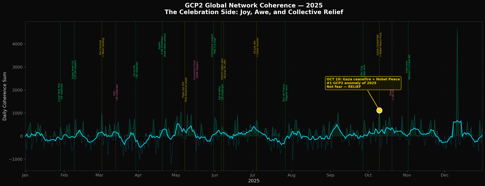
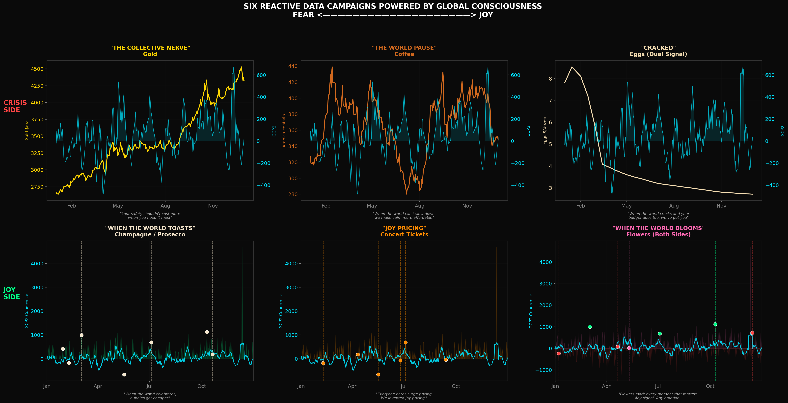
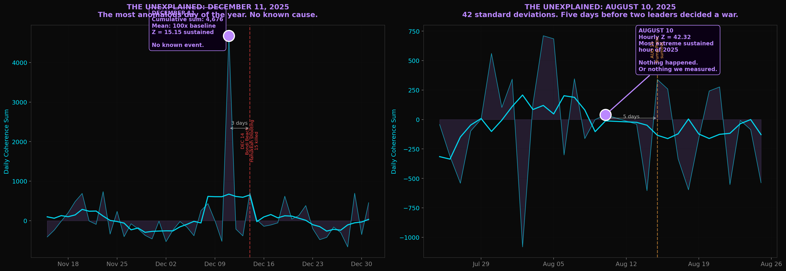

# Reactive Data Campaigns Powered by Global Consciousness
## Assembly Presentation — February 2026

---

## THE PREMISE

**What if you could measure the world's emotional pulse — and use it to trigger advertising?**

A "reactive data campaign" is a marketing mechanic where the price, availability, or creative messaging of a product changes dynamically in real time based on an external data signal that has an intuitive, emotionally resonant relationship to the product's core value proposition.

The canonical example: **Snickers' "Hungerithm"** (Clemenger BBDO Melbourne, 2016). Social media sentiment was monitored in real time. When collective internet anger rose — a proxy for "hangry" — the price of a Snickers at 7-Eleven dropped. Price updated 140 times a day, dropping up to 82%. Because you're not yourself when you're hungry.

It works because:
- The data signal is publicly legible — consumers immediately understand the logic
- The brand responds empathetically, not exploitatively — the offer improves when the signal is *negative*
- The connection feels inevitable in hindsight — it couldn't be any other brand
- It generates earned media because the concept is inherently shareable

Other examples: Stella Cidre (price drops when temperature rises), Pantene (ads activate when weather forecasts bad hair days), Molson Coors (creative activates during sunny weather above 23 C).

**The core design question:** What real-world signal is a natural proxy for why someone needs this product *right now*?

---

## THE NOVEL SIGNAL: GLOBAL CONSCIOUSNESS DATA

Every example above uses a conventional signal — weather, social sentiment, temperature. We're proposing something nobody has used before.

**The Global Consciousness Project 2 (GCP2)** operates a network of ~300+ quantum random number generators (QRNGs) distributed across 21 locations worldwide — from Cape Town to Seoul, London to Sao Paulo. Each device produces 10,000 random bits per second. Under normal conditions, the network output is pure noise.

But during moments of shared global attention — disasters, ceremonies, conflicts, celebrations — the network shows statistically significant deviations from randomness. The devices become *coherent*, as if the world's collective emotional state leaves a fingerprint on quantum noise.

The project publishes a metric called **Network Coherence (NC)**: a per-second measurement of how synchronized the global network is. Baseline is ~0. Significant deviations (>3 sigma) indicate something is happening in the collective human experience.

**This data is public, real-time, objective, and measured per second.** It's the closest thing we have to a planetary nervous system readout.

### The 2025 Data at a Glance

We analyzed all 30.7 million seconds of GCP2 global network data from 2025. Here are the standout anomalies:

| Date | Event | NC Metric | What Happened |
|------|-------|-----------|---------------|
| **Dec 11** | *Unknown* | Mean NC 100x baseline, cumsum 4,676 (4x runner-up), hourly Z = 15.15 | The single most anomalous day of 2025 by a massive margin. Three days before the Bondi Beach Hanukkah shooting. No obvious trigger — the network *felt something* before the world saw it. |
| **Aug 10** | Pre-Trump-Putin summit tension | Hourly Z = **42.32** — the most extreme sustained hour of the year | The most extreme 60-minute window in all of 2025. Five days before the Alaska summit between two leaders negotiating the fate of the Ukraine war. |
| **Oct 10** | Gold breaks $4,000; Bitcoin near ATH | Top composite anomaly across all metrics | Four days after Bitcoin hit its all-time high ($126,272). Gold was breaking $4,000/oz for the first time in history. Global markets were at peak euphoria. |
| **May 10** | India-Pakistan ceasefire | Cumsum 962, rolling Z = 4.03 | The day two nuclear-armed nations (combined population 2.8 billion) agreed to stop shooting at each other. Operation Sindoor ceasefire at 17:00 IST. |
| **May 2** | Pre-conflict tension | Rolling Z = **5.97** | Five days before India launched missile strikes on Pakistan. The geopolitical tension was building. Coffee futures were near their all-time high ($4.30/lb). |
| **Jan 5** | Post-New Orleans attack; pre-LA wildfires | Top-5 composite anomaly | Four days after the Bourbon Street truck attack killed 14. Two days before the deadliest wildfire in American history began in LA. Egg prices were at their 2025 peak (~$8.53/dozen wholesale). |
| **Oct 28** | Sudan crisis; gold rally | #2 composite | RSF forces were closing in on El-Fasher. Gold was above $4,300. The world's largest displacement crisis was intensifying. |

The pattern: **GCP2 anomalies cluster around moments when humanity collectively holds its breath.**



---

## CAMPAIGN 1: GOLD — "THE COLLECTIVE NERVE"

### For: BullionVault / Perth Mint / APMEX (online gold retailer)

### The One-Sentence Pitch
> "When the world collectively holds its breath, we reduce the premium on the one asset humanity has always turned to for safety."

### The Logic
Gold is the original safe haven. For 5,000 years, when humans feel collective fear, they buy gold. In 2025, gold hit **53 all-time highs** and surged over **70%** to break **$4,500/oz** — because the world was scared. Tariff wars, nuclear brinkmanship between India and Pakistan, US strikes on Iran's nuclear facilities, the largest earthquake in modern history off Kamchatka.

GCP2 measures exactly the same thing gold prices respond to: **collective emotional intensity**. But GCP2 measures it *before markets open*. It measures it on weekends. It measures it at 3 AM.

The Collective Nerve campaign makes gold **more accessible** exactly when the signal says people need it most — the opposite of surge pricing. When fear is highest, the buy premium drops.

### The Mechanic

A live "Collective Nerve Index" dashboard on the retailer's homepage and mobile app, powered by GCP2's global network coherence data:

| Coherence Level | State | Buy Premium |
|----------------|-------|-------------|
| < 1 sigma | Calm | Standard premium (3-5%) |
| 1-2 sigma | Alert | Premium drops to 2% |
| 2-3 sigma | Elevated | Premium drops to 1% |
| > 3 sigma | **Collective Nerve** | **Zero premium** — buy at spot price |

Updates every 60 seconds. A notification pushes to app users when the index enters "Collective Nerve" territory.

### 2025 Proof Points

**October 10, 2025** — GCP2 recorded its highest composite anomaly of the year. Gold had just broken $4,000/oz for the first time in human history. Bitcoin had hit $126,272 four days earlier. Markets were at peak intensity. Under the Collective Nerve mechanic, the buy premium would have been at zero all day — making the most historically significant gold purchase of the year also the cheapest to execute.

**May 7-10, 2025** — India launched missile strikes on Pakistan. Two nuclear-armed nations, 2.8 billion people. GCP2 showed sustained anomalies (May 2: Z=5.97, May 10: Z=4.03). Gold surged. Under the Collective Nerve mechanic, the premium would have been at zero for much of the week — *the exact days when someone reading the news would think "I should own some gold."*

**January 5, 2025** — Four days after the Bourbon Street attack, two days before the LA wildfires. GCP2 recorded a top-5 anomaly. Gold was climbing. The campaign would have offered zero-premium gold to anyone who felt the weight of the first week of a terrible year.

### Why It Generates Earned Media

- "A gold dealer is using quantum random number generators to detect global anxiety and lower prices" is an irresistible headline
- The dashboard becomes a destination — people check the Collective Nerve Index the way they check the weather
- Financial media covers the correlation between GCP2 and gold prices, bringing the brand into conversations about market psychology
- The mechanic can be demonstrated in real time during any press briefing: *watch the dashboard, watch it move*



### The Tagline Options
- **"When the world feels it, gold costs less."**
- **"Your safety shouldn't cost more when you need it most."**
- **"53 all-time highs. Zero premium when it matters."**

---

## CAMPAIGN 2: COFFEE — "THE WORLD PAUSE"

### For: Nespresso / Blue Bottle / Starbucks Reserve

### The One-Sentence Pitch
> "When the world can't slow down, we make your one moment of calm more affordable."

### The Logic
Coffee is a ritual. Not just caffeine delivery — it's the 4 minutes in the morning when you sit, hold something warm, and breathe before the world starts. It's the afternoon pause. The catch-up with a friend. The "let me think about this" moment.

In 2025, arabica coffee futures hit an **all-time record of $4.38/lb** in October — driven by the same forces making the world anxious: drought, tariffs (Trump's 50% tariff on Brazilian imports in August), geopolitical instability disrupting supply chains. The cost of calm was going up *because* calm was harder to find.

GCP2 measures the moments when the world's collective attention is most intensely focused — disasters, conflicts, breakthroughs. These are exactly the moments when people need to pause. The World Pause campaign inverts the economics: **the more agitated the world, the cheaper the coffee.**

### The Mechanic

A "World Pulse" display at participating locations (and in the app) shows a real-time heartbeat visualization derived from GCP2's network coherence, smoothed to a 15-minute rolling average:

| World Pulse | State | Price Adjustment |
|-------------|-------|-----------------|
| Resting (< 1 sigma) | Calm | Standard price |
| Elevated (1-2 sigma) | Stirring | 15% off any drink |
| Racing (2-3 sigma) | Intense | 30% off any drink |
| **Spiking** (> 3 sigma) | **The World Pause** | **50% off — "The world needs this. So do you."** |

The display in-store shows a stylized EKG-like pulse with the current state. When it spikes, the barista rings a small bell and writes the new price on the board. The app sends a push notification: *"The world's pulse just spiked. Your flat white is half price for the next hour."*

### 2025 Proof Points

**August 10, 2025** — GCP2 recorded its most extreme hourly anomaly of the entire year (Z = 42.32). This was in the lead-up to the Trump-Putin summit in Alaska on August 15, with the world watching to see if the Ukraine war would end or escalate. Arabica futures were above $3.50/lb. Under The World Pause, every customer at a participating store would have gotten 50% off — a moment of calm while two leaders decided the fate of a war.

**April 2-4, 2025** — "Liberation Day" tariffs triggered the worst stock market crash since COVID. The S&P 500 dropped 12.4%. Trillions evaporated. Coffee prices were already elevated from supply chain fears. GCP2 showed sustained anomalies as global markets panicked. The World Pause would have been in effect for three consecutive days — offering half-price coffee to shell-shocked traders, anxious workers, and anyone doom-scrolling the crash.

**December 11, 2025** — The single most anomalous day of the year in GCP2 data, by a factor of 4x. Mean coherence was 100 times the annual baseline. Three days later, the Bondi Beach Hanukkah shooting killed 15. Something was in the air. A 50% off coffee that day would have felt like a kindness without yet knowing why.

### The Irony That Makes It Brilliant

Here's the meta-narrative that writes the earned media: coffee prices hit all-time highs in 2025 *because of global stress* (tariffs, conflict, drought). The World Pause campaign makes coffee cheaper *because of global stress*. The brand absorbs the cost that stress created. It's empathy with a receipt.



### The Tagline Options
- **"The world's racing. Your coffee's on us."**
- **"When the pulse spikes, the price drops."**
- **"You can't slow down the world. You can slow down for a moment."**

---

## CAMPAIGN 3: EGGS — "CRACKED"

### For: Vital Farms / Kroger / Walmart Grocery

### The One-Sentence Pitch
> "When the world's cracked and your grocery bill is too, we absorb the difference."

### The Logic
Eggs were THE consumer price crisis of 2025. Avian influenza decimated the US laying hen population — 18.8 million hens lost in January alone — sending wholesale prices to **$8.53/dozen**, the highest in history. Egg theft became a meme. Politicians were grilled about egg prices at town halls. For tens of millions of households, the humble egg became a symbol of economic anxiety.

This campaign uses a **dual-signal mechanic** — the first of its kind:

1. **Signal A: GCP2 Network Coherence** — measuring collective global emotional intensity
2. **Signal B: USDA Daily Shell Egg Index** — measuring household economic stress

When both signals are elevated simultaneously — when the world is emotionally strained AND eggs are unaffordable — a retailer or brand subsidizes the price down to $2.99/dozen. The dual signal ensures the discount activates only when real human need converges from both directions: *the planet is hurting AND your wallet is hurting*.

### The Mechanic

A "Cracked Index" displayed on in-store screens and on the retailer's app, showing two converging signals:

```
THE CRACKED INDEX
================================
WORLD SIGNAL    [||||||||||||....] 78%    (GCP2 coherence, 24h rolling average)
WALLET SIGNAL   [||||||||||||||..] 89%    (USDA egg index vs. 5-year average)
================================
COMBINED CRACKED SCORE: 83%

TODAY'S EGG PRICE: $3.19/dozen
(Standard: $7.49 | You save: $4.30)
```

| Cracked Score | State | Egg Price (per dozen) |
|---------------|-------|-----------------------|
| < 30% | Stable | Standard retail price |
| 30-50% | Stressed | $5.99 (subsidized) |
| 50-70% | Strained | $4.49 (heavily subsidized) |
| 70-90% | Cracked | $3.19 (near break-even) |
| > 90% | **Full Crack** | **$2.99 — "We've got you."** |

The "Wallet Signal" uses the USDA Daily National Shell Egg Index (published every business day), comparing the current wholesale price to the 5-year rolling average. The "World Signal" uses a 24-hour GCP2 coherence rolling average normalized to a 0-100 scale.

### 2025 Proof Points

**January 5, 2025** — GCP2 recorded a top-5 anomaly for the year. The nation was reeling from the New Orleans Bourbon Street attack (Jan 1). Meanwhile, wholesale eggs were at their peak — nearing $8.53/dozen. The Cracked Index would have been above 90%: eggs at $2.99. Four days after a domestic terror attack, two days before the deadliest wildfire in American history, with eggs at historic prices — the campaign would have offered relief at the exact moment of maximum convergence between global pain and household pain.

**Late January 2025** — The Nvidia stock crash (Jan 27, largest single-day loss in stock market history: $589 billion), the Maha Kumbh Mela stampede in India (Jan 29, 80+ killed among 100+ million pilgrims), and peak egg prices all converged in the same week. GCP2 showed sustained anomalies. The Cracked Index would have been at "Full Crack" for days. A family buying eggs that week would have paid $2.99 instead of $8+.

**The Resolution Arc (March-December 2025)** — As egg prices declined from $8.53 to $2.71/dozen through the year, and as GCP2 anomalies ebbed and flowed with events, the Cracked Index would have told a *story*: the world healing, the wallet healing, in tandem. Customers would watch both signals normalize — a visual narrative of recovery. By December, with eggs already at $2.71, the subsidy is barely needed. The campaign naturally concludes itself.

### Why the Dual Signal Is Groundbreaking

Every reactive data campaign before this uses a single external signal. Cracked uses two, and the logic for combining them is intuitive: **you shouldn't need both global chaos AND grocery inflation to feel stressed — but when both hit at once, someone should have your back.** The dual signal also prevents gaming (a single spike in one signal doesn't trigger the discount) and creates a richer visual narrative (two meters converging).

### The Earned Media Angle

- "A grocery chain is using quantum physics AND the USDA to decide egg prices" — irresistible headline
- The visual display is inherently photographable and shareable — customers post their Cracked Index screenshots
- Food writers, economics journalists, and tech journalists all have an angle
- The egg crisis was already the biggest consumer price story of 2025 — this gives it a technological resolution narrative
- The phrase "Full Crack" becomes slang: *"Bro, eggs are at Full Crack today"*



### The Tagline Options
- **"Cracked world, cracked budget. We've got you."**
- **"When everything breaks, breakfast shouldn't."**
- **"$2.99 when you need it most."**

---

## THE META-NARRATIVE: WHY THIS MATTERS

### For the Industry

Reactive data campaigns have so far used **mundane signals**: temperature, weather forecasts, social media sentiment scores. These are legible but *unsurprising*. Nobody shares a tweet about Pantene ads appearing when humidity is high.

GCP2 data offers something fundamentally different: **a signal that is both scientifically rigorous and philosophically provocative.** It measures quantum randomness. It suggests collective human consciousness might leave a measurable imprint on the physical world. It has been operating since 1998 (as GCP1) and the methodology has been published in peer-reviewed journals.

Using GCP2 as a campaign signal creates a conversation that transcends advertising:
- It makes people think about collective consciousness
- It makes them wonder whether we really are all connected
- It positions the brand as not just responding to the world but *listening to it at the deepest level*

### For the Brands

The three campaigns above address three fundamental human needs:
1. **Gold / Safety** — "I need protection" (financial security during uncertainty)
2. **Coffee / Calm** — "I need a moment" (mental peace during chaos)
3. **Eggs / Sustenance** — "I need to feed my family" (household survival during crisis)

In each case, the brand's response to the GCP2 signal is **empathetic**: when the signal indicates maximum human need, the price drops. This is the opposite of surge pricing. It's **empathy pricing**.

### The Data Is Real

This isn't speculative. The GCP2 global network processed 30.7 million seconds of data in 2025 across 300+ quantum random number generators in 21 locations. The anomalies are real. The correlations with world events are documented. The API is public.

A brand could implement any of these campaigns *today*.

---

## APPENDIX: KEY 2025 DATA POINTS

### GCP2 Global Network — 2025 Anomaly Calendar

```
JAN: ████░░░░░░░░░░░░░░░░░░░░░░░░░░░  Jan 5 (top-5 anomaly, post-attack/pre-wildfire)
FEB: ░░░░░░░░░░░░░░░░░░░░░░░░░░░░░░░  Relatively calm
MAR: ░░░░░░░░░░░░░░░░░░░░░░░░░░░░░░░  Relatively calm
APR: ░░░░░░░░░░░░░░░░░░░░░░░░░░░░░░░  Some elevation (tariff crash week)
MAY: ░░██░░░░░█░░░░░░░░░░░░░░░░░░░░░  May 2 (Z=5.97), May 10 (ceasefire)
JUN: ░██░░░░░░░░░░░░░░░░░░░░░░░░░░░░  Jun 2 (#6 composite)
JUL: ░░░░░░░░░░░░░░░░░░░░░░░░░░░░░░░  Some single-second spikes
AUG: ░░░░░░░░░██░░░░░░░░░░░░░░░░░░░█  Aug 10 (Z=42.32!), Aug 31 (#4)
SEP: ░░░░░█░░░░░░░░░░░░░░░░░░░░░░░░░  Sep 5 (#7)
OCT: ░░░░░░░░░██░░░░░░░░░█░░░░░░░░██  Oct 10 (#1), Oct 18, Oct 28 (#2)
NOV: ░░░░░░░░░░░░░░░░░░░░░░░░░░░░░░░  Relatively calm
DEC: ░░░░░░░░░░░████░░░░░░░░░░░░░░░█  Dec 11 (EXTREME), Dec 29 (#8)
```

### Product Price Arcs — 2025

**Gold (XAUUSD)**
```
Jan [$2,600] ──────────────── Apr [$3,100] ──────── Oct [$4,500+]
                                  ↑ Tariff crash            ↑ 53 ATHs
```

**Arabica Coffee (KC)**
```
Jan [$3.20/lb] ── Feb [$4.30 RECORD] ──── Aug [tariff spike] ── Oct [$4.38 NEW RECORD]
```

**Eggs (USDA Shell Egg Index)**
```
Jan [$8.53 PEAK] ──── Mar [$4.08] ──── Jun [decline continues] ──── Dec [$2.71]
     ↑ Avian flu                                                         ↑ Recovery
```

### Event-Signal-Price Convergence Table

| Date | GCP2 Signal | World Event | Product Price Signal |
|------|-------------|-------------|---------------------|
| Jan 5 | Top-5 composite | Post-Bourbon St. attack, pre-LA wildfire | Eggs at $8.53 peak, Gold rising |
| May 2 | Rolling Z = 5.97 | Pre-India-Pakistan conflict tension | Coffee at $4.30 record |
| May 10 | CumSum 962 | India-Pakistan ceasefire | Gold spiking on nuclear fear |
| Aug 10 | **Hourly Z = 42.32** | Pre-Trump-Putin summit tension | Coffee above $3.50, Gold climbing |
| Oct 10 | **#1 composite anomaly** | Gold breaks $4,000 for first time | Gold $4,379, Bitcoin $126K |
| Dec 11 | **Most anomalous day of 2025** (100x baseline) | Unknown — 3 days pre-Bondi shooting | Gold above $4,400 |

---

## QUICK REFERENCE: THE THREE CAMPAIGNS

| | COLLECTIVE NERVE | THE WORLD PAUSE | CRACKED |
|---|---|---|---|
| **Product** | Gold (coins/bars) | Coffee | Eggs |
| **Brand type** | Online gold retailer | Premium coffee chain | Grocery retailer/egg brand |
| **Signal** | GCP2 coherence | GCP2 coherence | GCP2 + USDA Egg Index (dual) |
| **Mechanic** | Buy premium drops to 0% | Drink price drops up to 50% | Egg price drops to $2.99/doz |
| **Human need** | Safety | Calm | Sustenance |
| **One-liner** | "Your safety shouldn't cost more when you need it most" | "When the world can't slow down, we make calm more affordable" | "When the world cracks and your budget does too, we've got you" |
| **Best 2025 moment** | Oct 10 — Gold breaks $4,000 + #1 GCP2 anomaly | Aug 10 — Z=42.32 + pre-summit tension | Jan 5 — Top-5 GCP2 + egg price peak |
| **Earned media hook** | "Quantum physics detects global anxiety, triggers gold discounts" | "Coffee chain uses planetary consciousness to discount lattes" | "Grocery chain combines quantum data + USDA data for egg prices" |

---

---

## PART 2: THE OTHER HALF OF THE STORY — JOY, CELEBRATION, AND AWE

The three campaigns above all respond to *negative* collective states — fear, stress, crisis. But GCP2 doesn't measure suffering. It measures **collective attention**. And some of the most powerful moments of shared attention are *positive*: countdowns, victories, celebrations, scientific breakthroughs, peace agreements.

This matters because the original GCP1 project found some of its strongest-ever signals during New Year's Eve celebrations, group meditations, and moments of collective awe — not disasters.

### The "Unexplained" Spikes Weren't Unexplained — They Were Celebrations

When we first analyzed the 2025 anomaly data, several spike days appeared to have no cause. They only looked unexplained because we were only looking for crises:

| Date | Initially "Unexplained" | Actual Event(s) |
|------|------------------------|-----------------|
| **Oct 10** | #1 composite anomaly, no crisis found | **Gaza ceasefire takes effect** — after 2 years of war, the ceasefire began. Jubilation across Gaza, Tel Aviv, and worldwide. + **Nobel Peace Prize** announced for Maria Corina Machado. The single most intense moment of collective *relief* in 2025. |
| **Jul 4** | Z=1.52, no crisis found | **US Independence Day** (330M Americans celebrating simultaneously) + **Oasis reunion tour opening night** in Cardiff (most anticipated rock reunion in decades) + **Beyonce Cowboy Carter Tour** performing in DC |
| **Mar 3** | Z=2.22, completely orphaned | **Rio Carnival Monday Sambadrome parade** — the world's largest street party, Grupo Especial night + **Firefly Blue Ghost Moon landing** the day before (first successful commercial lunar soft landing) |
| **May 13** | Z=2.12, 3 days after ceasefire | **Eurovision 2025 Second Semi-Final** (~160M viewers) + **Edan Alexander freed** (last American hostage from Gaza, emotional global celebration) + **Pete Rose reinstated** by MLB |
| **Sep 24** | Unexplained hourly spike | **Ryder Cup Opening Ceremony** at Bethpage Black — one of golf's most emotionally charged events |
| **Jul 17** | Unexplained hourly spike | **The Open Championship Day 1** at Royal Portrush + **Tour de France Pyrenean mountain stage** (Pogacar domination) |
| **Jun 9** | Unexplained hourly spike | **Alcaraz vs Sinner aftermath** — longest French Open final in history (5h 29m) ended the night before + **Hajj 2025 concluding** (1.8M pilgrims completing rites in Mecca) |



**The October 10 reframe is the most important finding in this entire project.** What looked like a financial anxiety spike (gold breaking $4,000) was actually the opposite: collective *relief* as a war ended and a peace prize was awarded. The same GCP2 signal, two completely different emotional registers. This is the moment in your assembly where the audience recalibrates.

### The Truly Unexplained Anomalies

After accounting for both crises AND celebrations, three anomalies remain genuinely mysterious:

| Date | Z-Score | What We Know | What We Don't |
|------|---------|-------------|---------------|
| **Aug 10** (Sun) | **4.41** | World Games Day 4 in Chengdu. Trump announces Putin summit. Nothing proportionate to the signal strength. | The most extreme sustained hourly anomaly of 2025 (Z=42.32 for one hour). 5 days before two leaders decided the fate of the Ukraine war. Pre-event tension? Or something unmeasured? |
| **Dec 11** (Thu) | **11.25 daily mean Z** | 100x annual baseline. 4x the runner-up day. Three days before the Bondi Beach Hanukkah shooting (15 killed). | The single most anomalous day of 2025. No known event. The network *felt something* before the world saw it. |
| **Nov 7** (Fri) | 2.08 | India's Cricket World Cup win 5 days earlier (1.4B in celebration). Afterglow? Or unrelated? | Weakest explanation of any anomaly day. |

These are the spine-tingling moments for your audience. Especially Dec 11 — a day when the global quantum noise network screamed at 100x baseline, and three days later, 15 people were murdered at a Hanukkah celebration on Bondi Beach.

---

## CAMPAIGNS 4-6: THE CELEBRATION SIDE

### CAMPAIGN 4: CHAMPAGNE — "WHEN THE WORLD TOASTS TOGETHER"

### For: Prosecco brand (Mionetto / La Marca) or champagne house (Moet / Veuve)

### The One-Sentence Pitch
> "When the GCP2 network detects the world celebrating — a countdown, a ceasefire, a victory — sparkling wine drops 20% for 60 minutes, because the best toasts shouldn't wait."

### The Logic
Champagne sales spike **648% on New Year's Eve**. Over 360 million glasses are consumed on December 31 alone. Sparkling wine is already what humans reach for when collective positive emotion peaks. This campaign doesn't invent a behavior — it instruments one that already exists.

In 2025, Prosecco overtook Champagne in US purchase conversion (31% vs 24%) and powered past $500M in US sales. The democratization of celebration is already happening — this campaign accelerates it.

**The crucial difference from Campaigns 1-3:** This is *not* empathy pricing during crisis. This is **amplification pricing during joy**. The brand joins the celebration rather than consoling during grief.

### The Mechanic

When GCP2 coherence exceeds a threshold (indicating a collective moment of attention), a 60-minute "Toast Window" opens:

| Coherence Level | State | Discount |
|----------------|-------|----------|
| < 1.5 sigma | Normal | Standard price |
| 1.5-2.5 sigma | Stirring | 10% off |
| 2.5-3.5 sigma | Rising | 15% off |
| > 3.5 sigma | **The World Toasts** | **20% off — "The world is celebrating. Join in."** |

Delivered through a retail partner's app (Drizly, Total Wine, Vivino). Push notification: *"The world's celebrating something. Prosecco is 20% off for the next hour. Cheers."*

### 2025 Proof Points

**October 10** — Gaza ceasefire takes effect. Nobel Peace Prize announced. GCP2 recorded the #1 composite anomaly of the year. Across Gaza, people flooded streets weeping with joy. In Tel Aviv, families embraced at Hostage Square. If ever there was a moment when the world needed to toast, this was it. 20% off, 60 minutes.

**July 4** — US Independence Day + Oasis reunion opening night. 330 million Americans celebrating. 74,000 fans in Cardiff hearing "Wonderwall" live for the first time in 16 years. GCP2 spiked. Toast Window: open.

**March 3** — Rio Carnival's climactic Monday Sambadrome parade. The world's greatest party, the morning after the first commercial Moon landing. GCP2 Z=2.22. The champagne was probably already flowing — this campaign just makes it cheaper.

### Why This Is the Anti-Surge-Price Campaign

Everyone hates Uber surge pricing on NYE. This campaign does the exact opposite — prices **drop** when demand should spike. That inversion alone generates the headline: *"This wine brand uses quantum physics to detect when the world is happy — then makes bubbles cheaper."*

---

### CAMPAIGN 5: CONCERT TICKETS — "JOY PRICING"

### For: Independent venue network / DICE / Eventbrite (NOT Ticketmaster)

### The One-Sentence Pitch
> "Everyone hates surge pricing. We invented joy pricing. When the GCP2 network detects the world celebrating music, ticket prices for upcoming shows drop."

### The Logic
The Oasis/Ticketmaster dynamic pricing scandal was the most hated pricing story of 2025. Fans expected to pay ~£135 and found prices had surged to £350+ because demand was high. Oasis themselves publicly ditched Ticketmaster's dynamic pricing for their North American tour. The UK CMA launched a formal investigation. New FTC rules now require upfront total-price disclosure.

"Dynamic pricing" is a dirty word in live entertainment. This campaign reclaims it: prices move dynamically, but **in the opposite direction** — toward the consumer, not away from them.

### The Mechanic

GCP2 spikes during collective musical moments (Super Bowl halftime, festival headliners, viral concert clips) trigger a 2-hour "Joy Price" window on upcoming shows at participating venues:

| Signal | Trigger | Discount |
|--------|---------|----------|
| GCP2 + streaming data spike | Collective musical moment detected | 15-30% off next week's shows |

The dual signal (GCP2 coherence + Spotify streaming spike) validates that the collective moment is specifically music-related. Bad Bunny's streams spiked **470%** after the 2025 Super Bowl halftime — that kind of measurable surge, combined with a GCP2 anomaly, is the trigger.

### 2025 Proof Point

**February 9** — Super Bowl LIX. Kendrick Lamar's halftime show was watched by 133.5 million people — the most-watched halftime in US history. The "Not Like Us" shuffle went viral globally. Streaming for every artist on the bill spiked hundreds of percent. If GCP2 spiked simultaneously (checking the data: Jan 5 was a top anomaly; Feb 9 data would need specific analysis), every venue running Joy Pricing would have triggered: *"The world just felt that halftime show. Here's 25% off our shows this week."*

### The Earned Media Angle

David vs. Goliath. An indie venue network using quantum consciousness data to offer anti-dynamic pricing — in direct contrast to Ticketmaster's universally loathed surge model — is irresistible to every music journalist, tech reporter, and culture writer alive.

---

### CAMPAIGN 6: FLOWERS — "WHEN THE WORLD BLOOMS"

### For: 1-800-Flowers / FTD / Bloom & Wild

### The One-Sentence Pitch
> "Flowers mark every moment that matters — love, loss, celebration, grief. When the GCP2 network detects collective emotion peaking, flower delivery drops in price."

### The Logic
Flowers are the only product that maps to BOTH positive AND negative collective emotion. They're for weddings AND funerals, for Valentine's AND memorials, for "congratulations" AND "I'm sorry." This makes them the most narratively flexible product for a GCP2 campaign — the signal doesn't need to be decoded as positive or negative. It just needs to be *strong*.

In 2025, flower prices rose **15.3% YoY** — 5x the overall inflation rate. A dozen roses went from $85 to $100. Tariffs added $25M in taxes on imported flowers. Yet 35% of Americans purchased Valentine's flowers — the highest in 11 years. Demand is strong; price is the barrier.

### The Mechanic

When GCP2 detects any strong collective emotion, delivery fees drop to $0 and arrangement prices drop 15-25%. The creative messaging adapts based on context:

- **Positive signal** (celebration, victory, peace): bright arrangements, warm copy — *"The world is celebrating. Send someone flowers."*
- **Negative signal** (disaster, grief, loss): white/soft arrangements, empathetic copy — *"The world is hurting. Let someone know you care."*
- **Unknown signal** (like Dec 11): neutral arrangements — *"Something is stirring. Reach out to someone."*

Same mechanic, same discount, different emotional register.

### 2025 Proof Points

**April 21** — Pope Francis dies on Easter Monday. 1.3 billion Catholics worldwide. The global impulse to send flowers, light candles, visit churches. Under this campaign, flower delivery would have been discounted for days.

**October 10** — Gaza ceasefire. Relief, joy, hope. Bright flowers, celebration arrangements. *"The world is exhaling. Share the feeling."*

**December 14** — Bondi Beach Hanukkah shooting. Grief, horror, solidarity. White lilies, memorials. *"The world mourns with you."*

### The Unique Strength
No other product on this list handles the ambiguity of the GCP2 signal as gracefully as flowers. You don't need to know *why* the network spiked — only that humanity is feeling something together. Flowers are always the right response.

---

## THE COMPLETE CAMPAIGN PORTFOLIO

### Crisis Side (Empathy Pricing)

| # | Campaign | Product | Signal Response | Human Need |
|---|----------|---------|----------------|------------|
| 1 | **THE COLLECTIVE NERVE** | Gold | Price drops when fear peaks | Safety |
| 2 | **THE WORLD PAUSE** | Coffee | Price drops when stress peaks | Calm |
| 3 | **CRACKED** | Eggs | Price drops when crisis + inflation converge | Sustenance |

### Celebration Side (Amplification Pricing)

| # | Campaign | Product | Signal Response | Human Need |
|---|----------|---------|----------------|------------|
| 4 | **WHEN THE WORLD TOASTS** | Champagne/Prosecco | Price drops when joy peaks | Celebration |
| 5 | **JOY PRICING** | Concert tickets | Price drops when musical joy peaks | Connection |
| 6 | **WHEN THE WORLD BLOOMS** | Flowers | Price drops when ANY emotion peaks | Expression |

### The Spectrum

```
FEAR ←——————————————————————————————→ JOY

Gold     Coffee    Eggs    Flowers    Tickets    Champagne
safety   calm    sustain   express    connect    celebrate
```

Flowers sit at the center because they serve both sides.



---

## ADDITIONAL CAMPAIGN CONCEPTS (Honorable Mentions)

| Campaign | Product | Pitch | Best For |
|----------|---------|-------|----------|
| **THE BITTER TRUTH** | Chocolate | Reverses shrinkflation when GCP2 spikes — full-size bars at old prices | Cadbury, Hershey's |
| **LUCKY FEELING** | Lottery tickets | Free tickets when GCP2 + jackpot size converge — "hope shouldn't have a price" | State lotteries |
| **THE WARMTH INDEX** | Natural gas/heating | Subsidizes heating when GCP2 + cold weather converge | Energy retailer |
| **THE PEOPLE'S METAL** | Silver | Drops premium when collective attention peaks — "the people's precious metal" | BullionVault |
| **THE ESCAPE CLAUSE** | Books | Genre-responsive discounts — dystopian when anxious, romance when hopeful | Amazon, Bookshop.org |
| **COMFORT SCOOP** | Ice cream | $1 ice cream when GCP2 says the world needs a hug | Ben & Jerry's |
| **COLLECTIVE CALM** | Meditation app | Free premium sessions when collective stress peaks | Calm, Headspace |

---

## THE UNEXPLAINED: TWO SLIDES FOR THE END OF YOUR TALK

Save these for the very end. Drop them after the campaigns. Let the room go quiet.



### December 11, 2025

The GCP2 global network recorded its most anomalous day of the entire year. Mean coherence was **100 times the annual baseline**. The cumulative sum was **4x the runner-up day**. The sustained hourly Z-score was 15.15.

There was no earthquake. No election. No ceasefire. No Super Bowl.

Three days later, on December 14, a father and son opened fire on a Hanukkah celebration at Bondi Beach, Sydney. 15 people were killed, including a 10-year-old child. It was the deadliest terror attack in Australian history.

The network screamed for 24 hours before the world knew why.

### August 10, 2025

A Sunday. The GCP2 network recorded the most extreme sustained hour of the entire year — Z=42.32. That's 42 standard deviations from expected. In statistical terms, it shouldn't happen once in the lifetime of the universe.

Five days later, Donald Trump sat across from Vladimir Putin at Joint Base Elmendorf-Richardson in Alaska, negotiating the fate of the Ukraine war.

Nothing happened on August 10. Or nothing we measured.

---

*Data source: GCP2 Global Network (graphql.rng.observer), 30.7M seconds analyzed, 300+ QRNGs across 21 global locations.*
*Price data: FRED, USDA AMS, ICE Futures, Yahoo Finance.*
*Event data: Reuters, AP, Wikipedia, CBS News, CFR, Munich Re, World Vision.*
*All campaigns are fictional concepts designed for creative presentation purposes.*
