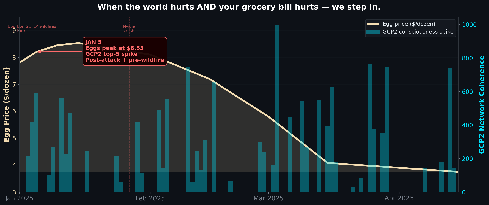
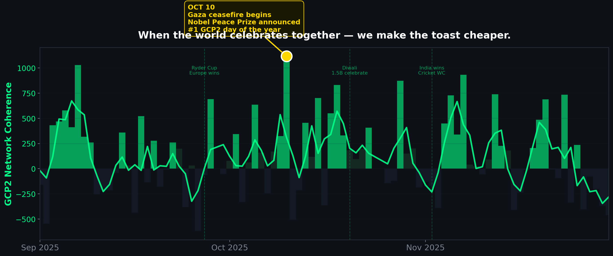

# Reactive Data Campaigns Powered by Global Consciousness

---

## Slide 1: What if you could read the world's mood — live?

- **500+ quantum random number generators** sit in 21 cities worldwide, outputting noise 24/7
- When billions of people focus on the same thing — a disaster, a ceasefire, a World Cup final — **the noise stops being random**
- It's called the **Global Consciousness Project** (GCP2). It's been running since 1998. The data is public and real-time.
- Think of it as a **live heartbeat monitor for the planet** — it spikes when humanity collectively feels something
- We analyzed every second of 2025 data (30.7 million data points) and matched spikes to real events and real product prices

---

## Slide 2: The crisis side — "CRACKED"

**The idea:** When the world is hurting AND your grocery bill is hurting, a retailer subsidizes eggs to $2.99/dozen.

In January 2025, eggs hit $8.53/dozen (avian flu crisis) at the exact same time GCP2 was spiking from the Bourbon Street attack and the LA wildfires. Both signals — global pain and household pain — peaked together. That's when the discount triggers.

---

## Slide 3: The celebration side — "WHEN THE WORLD TOASTS"

**The idea:** When GCP2 detects the world celebrating, champagne drops 20% for one hour. The opposite of surge pricing.

October 10 was GCP2's #1 anomaly of the entire year. Not a disaster — the Gaza ceasefire took effect and the Nobel Peace Prize was announced. The world exhaled together. That's the moment a champagne brand says: *"The world is celebrating. Join in."*

---

*Data: GCP2 Global Network (graphql.rng.observer) | 30.7M seconds, 500+ QRNGs, 21 locations | All campaigns fictional*
